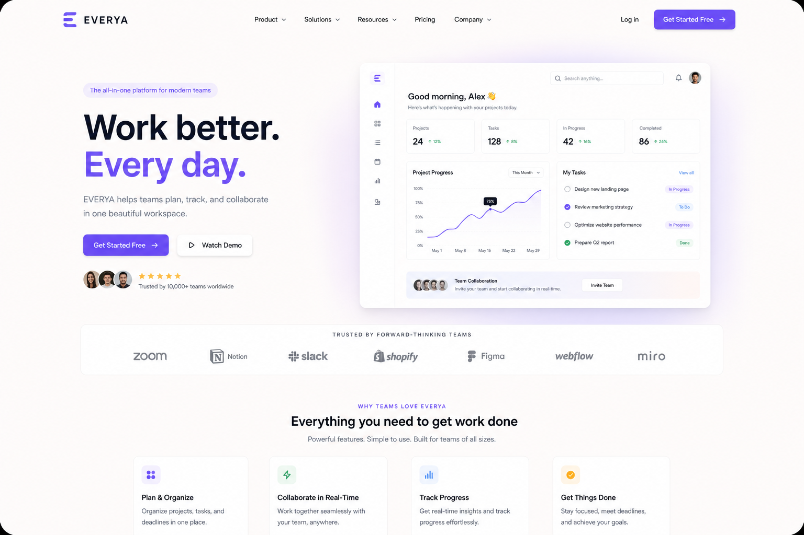
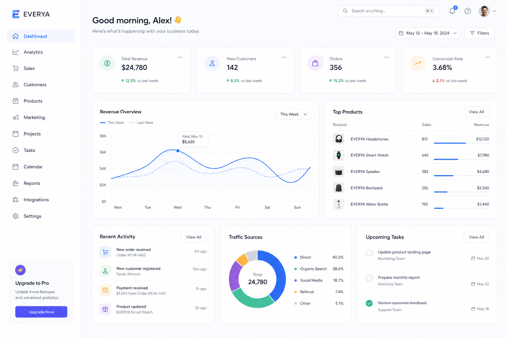
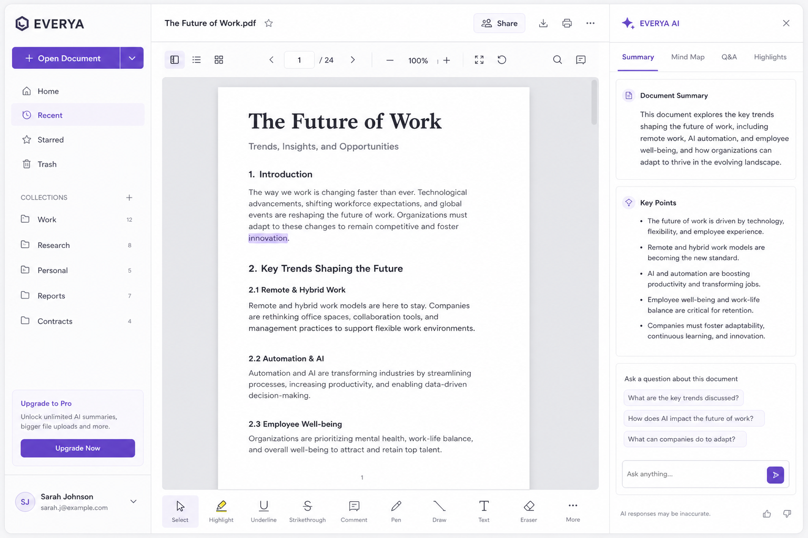
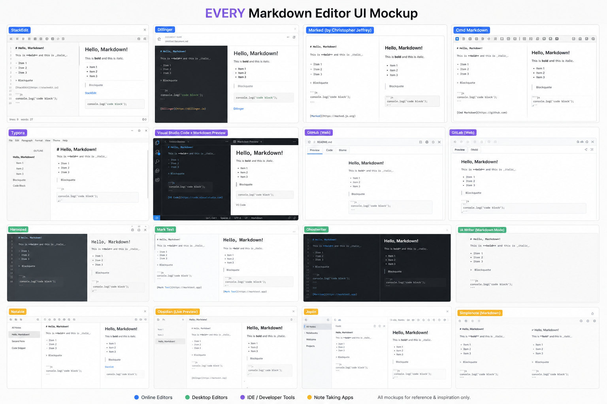
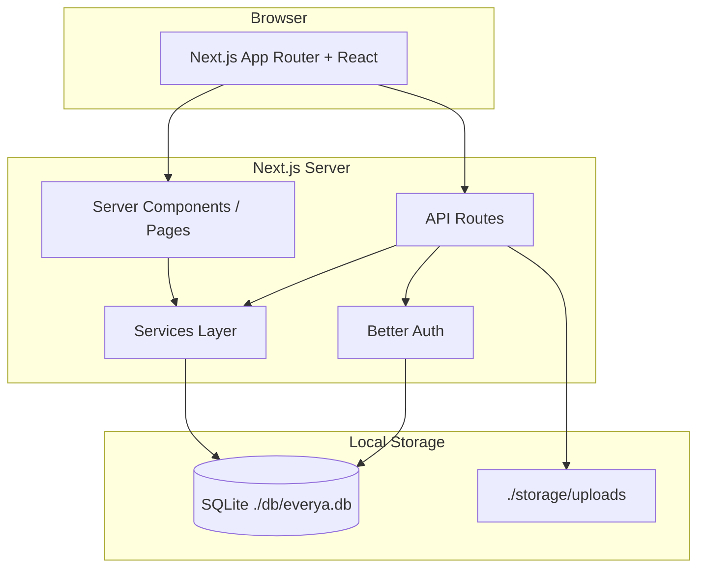

# EVERYA

**Structured knowledge for modern technical teams.**

EVERYA is a high-performance, minimal, enterprise-grade **technical documentation and publishing platform**. It is built for technical writers, developers, SREs, and engineering teams who need structured docs—not a blog—with repositories, nested folders, markdown authoring, engagement metrics, and a clean professional UI.

> **Repository layout:** This project lives in the `everya/` directory of the [eveyra](https://github.com/aresiddharthareddy/eveyra) GitHub repository.

---

## Table of contents

- [Overview](#overview)
- [Screenshots](#screenshots)
- [Features](#features)
- [Architecture](#architecture)
- [Tech stack](#tech-stack)
- [Prerequisites](#prerequisites)
- [Installation & setup](#installation--setup)
- [Environment variables](#environment-variables)
- [Running the app](#running-the-app)
- [Demo accounts](#demo-accounts)
- [Project structure](#project-structure)
- [Key routes & pages](#key-routes--pages)
- [API reference](#api-reference)
- [Database](#database)
- [Development workflow](#development-workflow)
- [Deployment notes](#deployment-notes)
- [Troubleshooting](#troubleshooting)
- [Roadmap](#roadmap)
- [License](#license)

---

## Overview

EVERYA helps teams:

- **Organize** documentation in repositories with nested folders (GitHub / Notion–inspired structure)
- **Author** markdown with live preview, syntax highlighting, and image uploads
- **Collaborate** via threaded comments, ratings, likes, and bookmarks
- **Measure** reader counts, reading time, and popularity metrics
- **Control access** with Public, Private, and Enterprise repository visibility

The initial release is **local-first**: SQLite database at `./db/everya.db`, file uploads at `./storage/uploads`, and a single-command dev experience—no Docker or cloud services required.

---

## Screenshots

UI previews of the EVERYA interface (minimal, enterprise-grade design):

### Landing page

Public marketing page with featured repositories and popular documentation.



### Dashboard

Signed-in workspace showing your repositories, recent documents, and bookmarks.



### Document reader

Full document view with stats (rating, readers, reading time), table of contents, and discussion.



### Markdown editor

Live-preview editor with autosave and image drag-and-drop support.



### Explore

Discover public repositories and popular docs across the platform.


---

## Features

### Authentication & profiles

| Feature | Description |
|---------|-------------|
| Sign up / Sign in | Email + password via Better Auth |
| Unique usernames | Global `@username` handles (e.g. `@alex`) |
| Sessions | Persistent JWT/session auth |
| Profiles | Avatar, bio, repositories, published docs, activity |

### Repositories

| Type | Description |
|------|-------------|
| **Public** | Visible to everyone on Explore |
| **Private** | Only visible to the owner |
| **Enterprise** | Marked for org/internal use (foundation for future ACL) |

Each repository supports:

- Nested **folders** and subfolders
- Collapsible **tree sidebar**
- **Breadcrumbs** for navigation
- Multiple **markdown documents**

### Documents

- Markdown with **GFM** (tables, task lists, etc.)
- **Syntax-highlighted** code blocks
- **Image uploads** (stored locally, optimized with Sharp)
- **Live preview** editor
- **Autosave** while editing
- Reading time, reader count, aggregate ratings

### Engagement

- **1–5 star** document ratings
- **Likes** and **bookmarks**
- **Threaded comments** with replies and comment likes
- **Notifications** for comments, likes, ratings

### Search & UX

- **Instant search** across documents and repositories
- **⌘K / Ctrl+K** search modal
- **Dark / light** theme toggle
- **Responsive** layout (collapsible sidebars on mobile)
- Three-column layout: nav · content · TOC/stats

---

## Architecture



**Design principles**

- Monolithic Next.js app (simple to run locally; modular folders for future scale)
- Server-side rendering for fast first paint
- Prisma ORM for type-safe database access
- Local SQLite—swap datasource for PostgreSQL in production later

---

## Tech stack

| Layer | Technology |
|-------|------------|
| Framework | Next.js 15+ (App Router) |
| Language | TypeScript |
| UI | React, Tailwind CSS v4, shadcn-style components |
| Animation | Framer Motion |
| State | Zustand |
| Auth | Better Auth (email/password) |
| ORM | Prisma |
| Database | SQLite (`./db/everya.db`) |
| Editor | `@uiw/react-md-editor` |
| Markdown | `react-markdown`, `remark-gfm`, `rehype-highlight` |
| Images | Sharp (optimization) |

---

## Prerequisites

Before you begin, ensure you have:

| Requirement | Version |
|-------------|---------|
| **Node.js** | 20.x or later recommended |
| **npm** | 10.x or later |
| **Git** | Any recent version |

**Optional (production / server):**

- `sudo` access if binding to **port 80**
- Open firewall/security-group ports **80** (HTTP) for remote access

---

## Installation & setup

### 1. Clone the repository

```bash
git clone https://github.com/aresiddharthareddy/eveyra.git
cd eveyra/everya
```

### 2. Install dependencies

```bash
npm install
```

This also runs `prisma generate` via the `postinstall` script.

### 3. Configure environment

```bash
cp .env.example .env
```

Edit `.env` for your environment (see [Environment variables](#environment-variables)).

### 4. Start the development server

```bash
npm run dev
```

On first run, the app automatically:

1. Creates `./db` and `./storage/uploads` if missing
2. Runs `prisma db push` to create/update the SQLite schema
3. Seeds demo users, repositories, and documents if the database is empty

### 5. Open in browser

| Environment | URL |
|-------------|-----|
| Local | [http://localhost](http://localhost) (port **80**) |
| Remote server | `http://YOUR_SERVER_IP` (use **http**, not https, unless you configure TLS) |

> **Port 80 note:** Binding to port 80 on Linux often requires elevated privileges:
>
> ```bash
> sudo npm run dev
> ```

---

## Environment variables

Create `.env` from `.env.example`:

```env
# SQLite database file (relative to project root)
DATABASE_URL="file:./db/everya.db"

# Better Auth — use a long random string in production
BETTER_AUTH_SECRET="change-me-to-a-secure-random-string"

# Must match how users access the app in the browser
BETTER_AUTH_URL="http://localhost"
NEXT_PUBLIC_APP_URL="http://localhost"
```

### Remote server example

If deploying to `http://98.93.146.99`:

```env
BETTER_AUTH_URL="http://98.93.146.99"
NEXT_PUBLIC_APP_URL="http://98.93.146.99"
```

> Auth cookies and redirects depend on these URLs matching the browser address bar exactly.

| Variable | Required | Description |
|----------|----------|-------------|
| `DATABASE_URL` | Yes | Prisma SQLite connection string |
| `BETTER_AUTH_SECRET` | Yes | Session signing secret |
| `BETTER_AUTH_URL` | Yes | Server-side auth base URL |
| `NEXT_PUBLIC_APP_URL` | Yes | Client-side auth API base URL |

---

## Running the app

| Command | Description |
|---------|-------------|
| `npm run dev` | Dev server + auto DB setup (port 80) |
| `npm run build` | Production build |
| `npm start` | Run production build (port 80) |
| `npm run lint` | ESLint |
| `npm run db:push` | Push Prisma schema to SQLite |
| `npm run db:seed` | Seed demo content |
| `npm run db:reset` | **Destructive:** reset DB and re-seed |

### Production build

```bash
npm run build
npm start
```

---

## Demo accounts

After seeding, sign in with:

| Username | Email | Password |
|----------|-------|----------|
| `@alex` | alex@everya.dev | `demo12345` |
| `@infraops` | ops@everya.dev | `demo12345` |
| `@kernel` | kernel@everya.dev | `demo12345` |

### Sample content URLs

| Page | Path |
|------|------|
| Getting Started | `/r/alex/platform-docs/getting-started` |
| API Design | `/r/alex/platform-docs/api-design` |
| K8s Runbook | `/r/infraops/sre-runbooks/k8s-incident-runbook` |
| Explore | `/explore` |

---

## Project structure

```
everya/
├── app/                    # Next.js App Router
│   ├── (app)/              # Authenticated shell (dashboard, repos, settings)
│   ├── api/                # REST API routes
│   ├── login/              # Auth pages
│   ├── signup/
│   └── u/[username]/       # Public profiles
├── components/
│   ├── ui/                 # Buttons, inputs, cards, etc.
│   ├── layout/             # Sidebars, top bar, theme
│   ├── docs/               # Markdown render/editor, stats
│   ├── comments/           # Threaded discussion
│   ├── search/             # ⌘K modal
│   └── landing/            # Marketing hero
├── lib/                    # Auth, Prisma client, utilities
├── services/               # Business logic (search, documents, repos)
├── hooks/                  # Zustand UI store
├── types/                  # Shared TypeScript types
├── prisma/
│   ├── schema.prisma       # Database schema
│   └── seed.ts             # Demo data
├── scripts/
│   └── ensure-db.js        # Auto setup on dev/build
├── db/                     # SQLite files (gitignored)
├── storage/uploads/        # Uploaded images (gitignored)
└── docs/screenshots/       # README UI previews
```

---

## Key routes & pages

| Route | Description |
|-------|-------------|
| `/` | Landing page |
| `/login`, `/signup` | Authentication |
| `/dashboard` | User workspace |
| `/explore` | Public discovery |
| `/r/{user}/{repo}` | Repository view + folder tree |
| `/r/{user}/{repo}/{doc}` | Document reader + comments |
| `/r/{user}/{repo}/{doc}/edit` | Markdown editor (author) |
| `/r/{user}/{repo}/new` | Create document |
| `/dashboard/new` | Create repository |
| `/u/{username}` | Public profile |
| `/settings` | Profile & theme |
| `/notifications` | Activity feed |

---

## API reference

| Method | Endpoint | Description |
|--------|----------|-------------|
| * | `/api/auth/[...all]` | Better Auth handlers |
| GET | `/api/search?q=` | Search docs & repos |
| POST | `/api/repositories` | Create repository |
| POST | `/api/documents` | Create document |
| PATCH | `/api/documents/[id]` | Autosave document |
| POST | `/api/documents/[id]/like` | Toggle like |
| POST | `/api/documents/[id]/rate` | Rate 1–5 stars |
| POST | `/api/documents/[id]/bookmark` | Toggle bookmark |
| POST | `/api/comments` | Create comment/reply |
| POST | `/api/comments/like` | Like comment |
| POST | `/api/upload` | Image upload |
| GET | `/api/files/[filename]` | Serve uploaded file |
| GET | `/api/notifications` | List notifications |
| PATCH | `/api/users/profile` | Update profile |

---

## Database

### Schema highlights

- **User** — username, email, bio, avatar
- **Repository** — name, slug, visibility (PUBLIC | PRIVATE | ENTERPRISE)
- **Folder** — nested hierarchy per repository
- **Document** — markdown content, reading metrics
- **Comment** — threaded with `parentId`
- **Rating**, **DocumentLike**, **Bookmark**, **Notification**, **DocumentView**

### Manual database commands

```bash
# Apply schema changes
npm run db:push

# Re-seed demo data (on empty or after reset)
npm run db:seed

# Full reset (deletes all data)
npm run db:reset
```

The database file is stored at `./db/everya.db` and is **not** committed to Git.

---

## Development workflow

1. Create a feature branch from `main`
2. Run `npm run dev` and verify changes locally
3. Run `npm run lint` before committing
4. **Do not commit** `node_modules/`, `.next/`, `.env`, or `db/*.db`

### What gets gitignored

```
node_modules/
.next/
.env
db/*.db
storage/uploads/*
```

---

## Deployment notes

This is the **initial local development version**. For production:

1. Set strong `BETTER_AUTH_SECRET`
2. Point `BETTER_AUTH_URL` and `NEXT_PUBLIC_APP_URL` to your public URL
3. Consider PostgreSQL instead of SQLite
4. Use object storage (S3, etc.) instead of `./storage/uploads`
5. Put **nginx** or **Caddy** in front for HTTPS (Let’s Encrypt with a domain)
6. Run `npm run build && npm start` under a process manager (systemd, PM2)

### HTTP vs HTTPS

- Dev on a raw IP: use **`http://`** — the app does not ship with TLS
- Browsers that auto-upgrade to HTTPS will show `ERR_SSL_PROTOCOL_ERROR` until you configure a reverse proxy with SSL

---

## Troubleshooting

| Problem | Solution |
|---------|----------|
| **Login fails / redirect loop** | Ensure `.env` URLs match the browser address (including `http` vs `https`) |
| **Port 80 permission denied** | Run `sudo npm run dev` or use `next dev -p 3000` and update `.env` |
| **`prisma db push` fails** | Run `npm install` in `everya/`; use project-local Prisma (`npx prisma`) |
| **Empty database** | Run `npm run db:seed` |
| **Push rejected (large file)** | Never commit `.next/` or `node_modules/`; see `.gitignore` |
| **SSL error on IP** | Use `http://` or configure nginx + certificate |

---

## Roadmap

Foundations included in v0.1:

- [x] Auth, profiles, repositories, nested folders
- [x] Markdown docs, editor, comments, ratings
- [x] Search, notifications, dark mode
- [x] Local SQLite + file storage

Planned for future versions:

- [ ] Team / organization workspaces
- [ ] Fine-grained Enterprise ACL
- [ ] Full-text search (SQLite FTS or external engine)
- [ ] PostgreSQL + S3 production profile
- [ ] Real-time collaborative editing

---

## License

Private — initial development version. All rights reserved by the project owner.

---

## Quick reference card

```bash
git clone https://github.com/aresiddharthareddy/eveyra.git
cd eveyra/everya
cp .env.example .env
npm install
npm run dev
# → http://localhost
# Login: alex@everya.dev / demo12345
```

**Questions or issues?** Open an issue on [GitHub](https://github.com/aresiddharthareddy/eveyra/issues).
